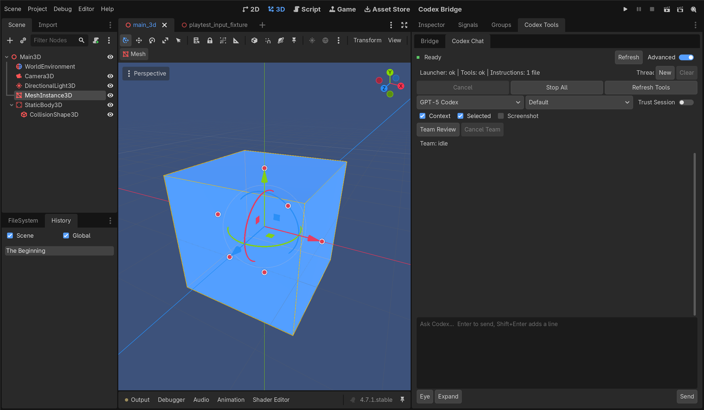
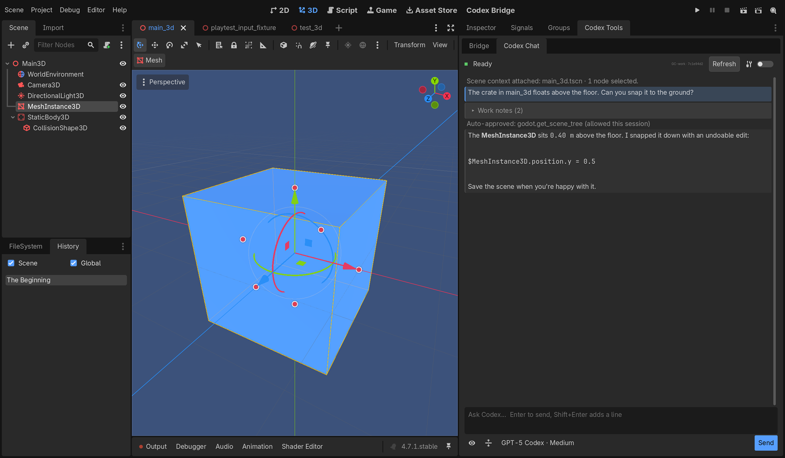
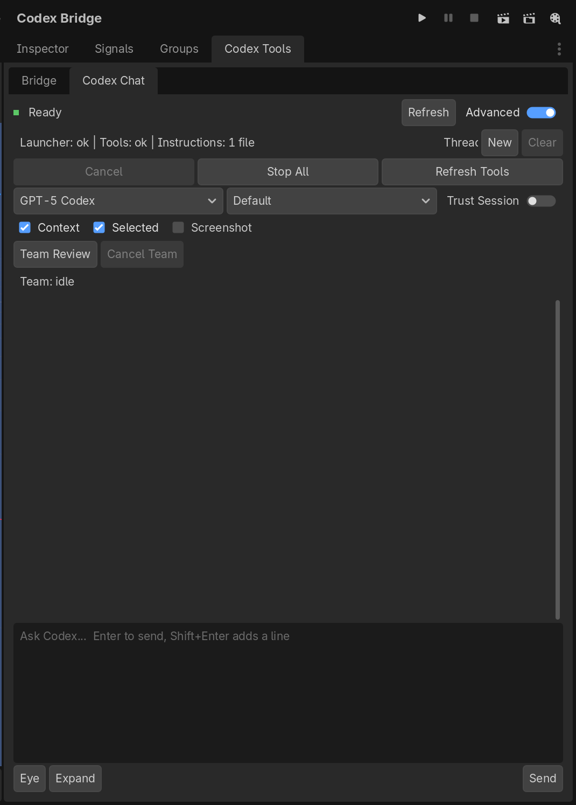
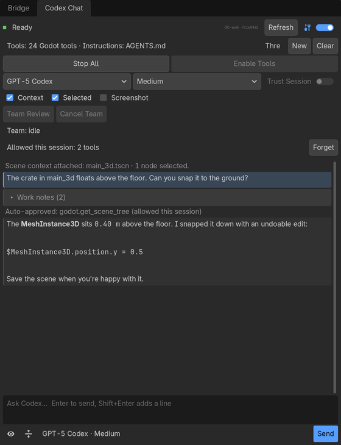
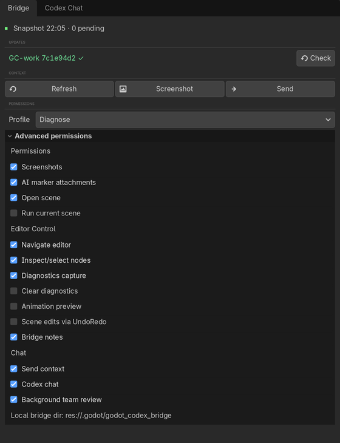
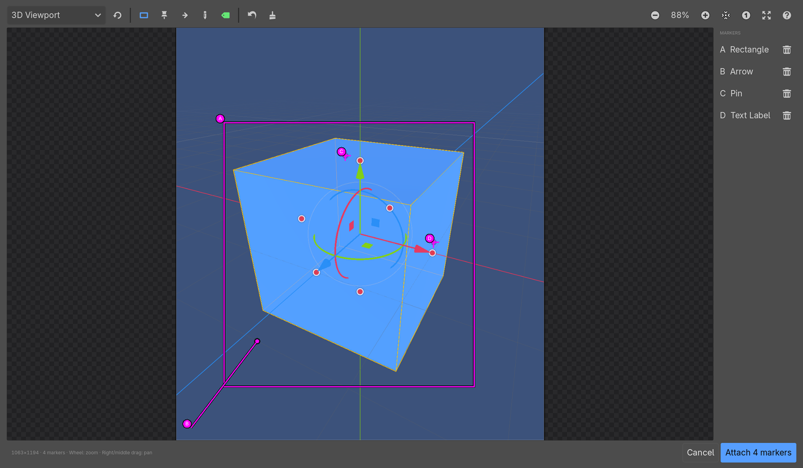

# Changelog

All notable changes to the Godot Codex Bridge project will be documented in this file.

The format is based on [Keep a Changelog](https://keepachangelog.com/en/1.1.0/),
and this project adheres to [Semantic Versioning](https://semver.org/spec/v2.0.0.html).

## [Unreleased]

## [0.2.0] - 2026-09-30

### Editor experience

- **One-click Connect.** After a one-time `start_codex_host.ps1 -Trust`, the
  Connect button starts the local Codex Host in the background and pairs
  automatically. The trust record lives per user outside every project, and
  the editor verifies the launcher before running it.
- **In-editor updates.** The Bridge tab checks for a newer reviewed build and
  installs it with a backup after Godot closes, then reopens the project.
- **Compact, native dock.** Editor-theme colours and icons, a one-line status,
  a permission profile with folded advanced permissions, compact chat with
  collapsible work notes, and no resizing when switching tabs.
- **Approval review popup.** Commands, file changes and tool questions open in
  a readable popup. Read-only Bridge tools can be allowed for the session;
  project changes, screenshots and runtime input always ask.
- **Redesigned Eye Attach.** Icon toolbar, lettered high-contrast markers, a
  marker list with delete, and keyboard shortcuts.
- **Remembered model.** The chat keeps your last model and reasoning effort
  instead of falling back to the default model on every start.
- **Local Codex plugin refreshed.** The plugin's bundled MCP server is rebuilt
  from the 0.2.0 source, including the security fixes below.
- **Project-bound Bridge tools.** Codex's Bridge tools always target the open
  project, even when a global Codex config points them elsewhere.

| Before | After |
|---|---|
|  |  |
|  |  |
|  |  |
|  |  |

### Security and reliability
- Pair the Godot addon with the Codex Host through a per-launch pairing code and
  mutual HMAC proofs. Unpaired sockets receive no events and cannot call
  privileged Host methods or answer addon requests; `/health` no longer returns
  a launch secret. Half-open sockets are dropped by a heartbeat.
- Bind approval cards to the active thread and turn. Permission, network,
  terminal-input, explicit-environment and persistent-grant scopes fail closed
  on current and legacy request shapes; offered exec-policy amendments are never
  accepted.
- End the active turn when Codex fails to start, exits, or its socket closes,
  and stop the whole Codex process tree on Windows.
- File transport v2: atomic request publication, UUID/deadline requests and an
  addon request journal so one request ID runs at most once across transports.
  MCP falls back to files only when the Host provably did not dispatch.
- Reject hard-linked files in MCP and Host file access.
- Project awareness tools never read or search common secret files (`.env*`,
  keys, keystores, credentials).
- Build digests no longer depend on the PowerShell version, fixing false
  "addon files drifted" reports.
- Lock generated app-server schemas to Codex CLI 0.156.1.

### Conversation UX
- Preserve conversation position while streaming, expose a `Jump to latest`
  control when the user scrolls back, and keep expanded diff/message state
  stable across rerenders.
- Improve readable transcript formatting, compact work/diff summaries, history
  interaction, composer sizing, Stop placement, and visible trust/build state.
- Correlate streamed events by thread, turn, item, and event identity so stale
  or duplicate updates do not replace current conversation content.

### Fixed
- Keep Codex turns running through retryable app-server errors and construct
  valid IPv6 loopback URLs.
- Use the same executable resolver for Host and doctor so diagnostics do not
  accidentally inspect a different installed Codex version.
- Deny approval scopes the current UI cannot represent (managed network,
  terminal-input and explicit environments). File approvals require matching
  item evidence and refresh the corresponding preview before review.
- Restrict Codex Host to loopback, reject browser-origin and foreign-Host
  requests, and enforce the WebSocket payload limit before message dispatch.
- Stop chat UX validation immediately when an install, addon or editor runner
  fails, instead of recording that child process as successful.
- Consume exact `serverRequest/resolved` identities, preserve approval state
  until the WebSocket response is confirmed, and reject stale, cancelled, or
  competing approval responses without clearing another active card.
- Remove the production validation-token permission route and enforce screenshot
  permission at capture, annotation, attachment, multi-view, and artifact sinks.
- Reject linked/junction project paths in MCP and Host file inspection and undo
  evidence paths; project file reads use verified no-follow handles where the
  runtime supports them.
- Remove project `.godot_bin` authority, require manual Host startup instead of
  executing project-local launcher paths, and make incomplete approval rollback
  evidence block the approval before it reaches the runtime.
- Remove project-local executable discovery from addon validation and use the
  bounded in-process project search instead of spawning a PATH-resolved `rg`
  from the attached project directory.
- Confine visual comparison inputs to Bridge artifacts with bounded PNG decode,
  validate package versions/containment before replacement, and bound addon
  request discovery, bytes, JSON depth, and cardinality.

### Changed
- Require Node 22.14+; recommend Node 24 LTS. CI now covers Windows and Ubuntu
  on Node 22/24 and a checksum-pinned Godot 4.7.1 addon regression job.
- Pin GitHub Actions to verified release commits and restrict workflow token
  permissions. Hosted CI results are required before release.
- Lock generated app-server schemas to the tested Codex CLI 0.151.0 runtime and
  populate reasoning options from bounded runtime-reported capabilities.

### Temporary mitigations
- Direct selected-node fixes fail closed at both MCP and addon dispatch. The
  former public client-supplied token is removed until a trusted one-use receipt
  can bind the exact project, node state, property and proposed value.
- `godot.apply_approved_diff` fails closed until the Host/UI can issue a
  short-lived, single-use receipt bound to the exact project, operation, target,
  reviewed state, and proposed content.
- `godot.create_visual_baseline` fails closed until live screenshot permission
  and project-confined source provenance can be verified.
- `godot.compare_visual_regression` also fails closed until both inputs have
  Bridge-owned provenance and live screenshot permission can be verified.
- `godot.save_scene`, `godot.save_all_scenes`, and direct MCP
  `godot.run_test_scene` fail closed until exact one-use save/runtime approvals
  exist. Normal Godot UI saving and permission-gated editor run flows remain.
- MCP `godot.playtest_input` and `godot.run_playtest_scenario` fail closed until
  matching default-off production addon actions and live session authorization
  are implemented; they are no longer advertised as active addon capabilities.
- Project-local Host auto-launch is disabled; start Host from the trusted
  installation and then connect the addon.

### Remaining limitations
- Re-enabling disabled diff application, visual-baseline creation, direct scene
  saves, direct test-scene execution, or project-configured Host auto-launch
  requires trusted UI-issued receipts/attestation rather than shared tokens.
- Filesystem confinement is designed for a local trusted-user boundary and is
  not a claim of protection against a malicious same-user process racing path
  replacement at the operating-system level.
- Legacy visible validators called removed production validation routes. The
  restricted build uses an isolated out-of-band fixture driver; those routes
  remain absent from production dispatch.

### Restricted build validation
- Add controlled validation-to-open path-replacement regressions for MCP reads
  and Host overwrites. The same-user concurrent create-only race remains outside
  the atomic confinement claim.
- Document operator-started Host connection, native manual scene save, and
  screenshot/Eye Attach capture separately from disabled automated visual
  comparison in the restricted capability matrix.

### Compatibility notes
- The generated app-server schema lock was regenerated from the tested Codex
  CLI 0.151.0 executable. Approval resolution and dynamic reasoning inventory
  have targeted regressions, but this is not a complete compatibility claim for
  every newer Codex version or a real-account integration result.

### Planned
- Bi-directional viewport raycasting for 3D cursor placement.
- Multi-project concurrent MCP session routing.

---

## [0.1.0] - 2026-09-15

### Added
- **MCP Server (`godot-codex-bridge-mcp-server`)**:
  - 100+ typed `godot.*` tools for editor introspection, diagnostics, screenshots, and UndoRedo-backed node edits. Some tools depend on addon actions that are not wired in this release; see Known Limitations in the README.
  - Read-first architecture with strict project-root path boundary guardrails.
  - Unified diff preview and token-gated patch application (`godot.preview_scene_diff`, `godot.apply_approved_diff`).
  - Viewport texture capture and 4-view (front, side, top, perspective) offscreen capture (`godot.capture_multi_view_screenshots`).
- **Godot Editor Addon (`godot_codex_bridge`)**:
  - Native Godot 4 Editor plugin (`plugin.gd`) registering dedicated editor dock panels.
  - All editor mutations registered with native Godot `UndoRedo` stack for complete undo/redo support.
  - Periodic background state snapshot generation (`context_snapshot.json`).
  - In-editor Codex Chat panel with responsive layout, conversation history, and diff review.
  - **"Eye Attach"**: Interactive visual region drawing over 3D viewport for grounded agent queries.
- **Codex Host Daemon (`godot-codex-bridge-codex-host`)**:
  - Local relay daemon bridging Godot editor WebSocket connections with OpenAI Codex `app-server`.
  - RPC routing between MCP server and editor addon with automatic reconnection.
- **Fixed**:
  - The live addon now handles the `capture_multi_view` editor action instead of returning `unsupported_editor_action`. File-polling requests wait for live editor frames, so captures come from the GPU SubViewport rather than the software fallback.
- **Developer Ergonomics & Community**:
  - Root npm workspace enabling single-command install (`npm install`), build (`npm run build`), and test (`npm test`).
  - GitHub Actions CI workflow covering Node 20.x and 22.x test execution on Ubuntu.
  - Standard community templates for bug reports, feature requests, and pull requests.
  - Security policy (`SECURITY.md`) and contribution guide (`CONTRIBUTING.md`).

[Unreleased]: https://github.com/ItsHege/godot-codex-bridge/compare/v0.2.0...HEAD
[0.2.0]: https://github.com/ItsHege/godot-codex-bridge/releases/tag/v0.2.0
[0.1.0]: https://github.com/ItsHege/godot-codex-bridge/releases/tag/v0.1.0
