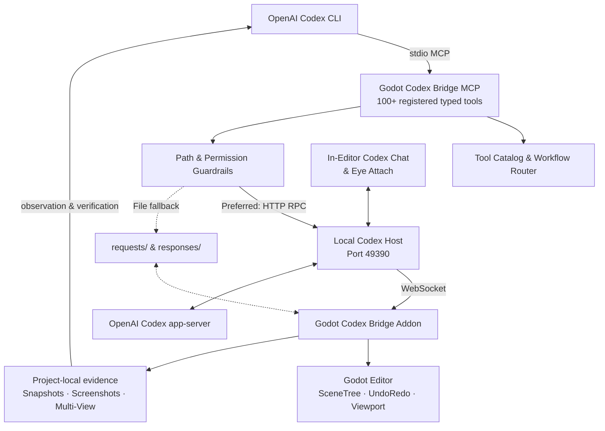

# Godot Codex Bridge

> **Godot Codex Bridge gives OpenAI Codex eyes, hands, and runtime feedback inside the Godot Editor.**

[](LICENSE)
[](https://godotengine.org)
[](https://nodejs.org)
[](https://modelcontextprotocol.io)

---

## The Problem

Coding agents are powerful at reading and editing source files, but game-engine work needs more than text access:

1. **No live engine context:** raw `.tscn` and `.gd` files do not expose the active scene tree, current selection, editor state, camera framing, or runtime conditions.
2. **No visual feedback:** an agent cannot reliably verify whether an object is floating, clipping, badly framed, or visually broken without viewport evidence.
3. **Unsafe direct mutation:** editing serialized scene files directly can bypass Godot's normal editor safeguards and undo history.

## What Godot Codex Bridge Enables

Godot Codex Bridge connects Codex to an active Godot 4 Editor session through a local MCP + addon architecture:

- A **Model Context Protocol (MCP)** server exposing **100+ registered typed `godot.*` tools** for scene introspection, diagnostics, guarded editor actions, diff previews, and visual evidence capture.
- A **Godot Editor Addon** that executes supported actions on the engine main thread, exports live context snapshots, captures viewport evidence, and integrates with Godot's native `UndoRedo` flow.
- A local **Codex Host** daemon that powers the in-editor Codex Chat experience and bridges to the OpenAI Codex `app-server`.
- **"Eye Attach" visual grounding** so users can mark an exact region of the editor and attach that visual context to the next Codex prompt.

---

## Key Features

- **Live Scene Introspection:** inspect active scene metadata, node hierarchies, selection, project files, autoloads, input maps, and diagnostics.
- **Visual Evidence & Multi-View Capture:** capture viewport screenshots and Front / Side / Top / Perspective proxy renders for a target Node3D.
- **UndoRedo-Backed Live Edits:** supported editor mutations are routed through Godot-native undo actions rather than raw scene-file rewriting.
- **Safe Diff Preview Workflow:** preview unified text diffs before applying approval-gated changes.
- **In-Editor Codex Chat:** run Codex from a native Godot dock with thread, model, context, screenshot, and session controls.
- **Eye Attach:** draw visual reference markers over the editor and attach them to the next Codex turn.
- **Explicit Save Boundary:** supported live experimentation remains separate from persistent scene saves until an explicit save action is requested.

---

## Architecture Overview



**MCP compatibility:** the standalone MCP server can also be used with other MCP-compatible coding clients. Codex is the primary workflow for this project and for the in-editor host integration.

---

## Closed-Loop Agent Workflow

Godot Codex Bridge is designed around an empirical development loop:

```text
  1. INSPECT   ──► Read active scene/editor context and diagnostics
  2. MODIFY    ──► Apply supported guarded editor changes
  3. RUN       ──► Execute bounded validation or scene checks where supported
  4. OBSERVE   ──► Capture screenshots, multi-view evidence, and logs
  5. VERIFY    ──► Check the result against real editor/runtime evidence
  6. SAVE      ──► Persist only after verification and explicit approval
```

---

## Visual Interface & Media

All screenshots below were captured from a real Godot 4.7 editor session running the included `minimal_3d_project` fixture.

### Codex Tools Dock

The addon docks next to the Inspector, with Bridge and Codex Chat tabs beside the live 3D scene.


### In-Editor Codex Chat

Connection status, thread controls, model and reasoning pickers, attachment toggles, team review controls, and the multiline composer.


### Granular Permissions

The Bridge tab exposes explicit permissions for screenshots, editor control, scene mutation, saving, chat, and review behavior.


### "Eye Attach" Annotation

Capture the editor, draw reference markers, and attach them to the next prompt so Codex can see the exact region you mean.


### Multi-View Verification

`godot.capture_multi_view_screenshots` renders Front, Side, Top, and Perspective proxy views of a Node3D target and saves local PNG evidence plus metadata.


---

## Safety Model

- **Local-Only Evidence:** screenshots, snapshots, logs, and annotation artifacts are stored under the target project's `.godot/godot_codex_bridge/` directory.
- **Read-First Philosophy:** inspection and diagnosis are separated from mutation permissions.
- **UndoRedo Protection:** supported live scene edits integrate with Godot's native undo stack.
- **Project-Root Guardrails:** file operations enforce project-root boundaries and reject unsafe traversal.
- **Diff Preview Before Apply:** supported text patch flows use reviewable diffs and approval tokens.
- **Explicit Save Boundary:** scene persistence is separate from live experimentation.

See [Safety Specifications](godot-codex-bridge/docs/SAFETY.md) for details.

---

## Requirements

- **Godot Engine:** Godot 4.x. Developed and validated against Godot 4.7.1; earlier 4.x releases are not yet verified.
- **Node.js:** `20.11` or higher.
- **Operating System:** Windows, Linux, or macOS.

---

## Quickstart

### 1. Clone & Build

```bash
git clone https://github.com/ItsHege/godot-codex-bridge.git
cd godot-codex-bridge

npm install
npm run build
npm test
```

### 2. Configure Godot

Set `GODOT_BIN` to your Godot executable if Godot is not already on `PATH`:

```bash
# Windows (PowerShell)
$env:GODOT_BIN = "C:\Path\To\Godot_console.exe"

# Linux / macOS
export GODOT_BIN="/usr/local/bin/godot"
```

### 3. Install the Addon

Copy:

```text
godot-codex-bridge/addons/godot_codex_bridge/
```

into your Godot project as:

```text
your-godot-project/
└── addons/
    └── godot_codex_bridge/
```

Then enable **Godot Codex Bridge** in **Project Settings → Plugins**.

For full setup and troubleshooting, see the [Quickstart Guide](godot-codex-bridge/docs/QUICKSTART.md).

---

## OpenAI Codex Setup

Add the MCP server to Codex using the CLI:

```bash
codex mcp add godot -- node "C:/path/to/godot-codex-bridge/godot-codex-bridge/mcp_server/dist/src/index.js" --project-root "C:/path/to/your-godot-project"
```

Or configure it in `.codex/config.toml`:

```toml
[mcp_servers.godot]
command = "node"
args = [
  "C:/path/to/godot-codex-bridge/godot-codex-bridge/mcp_server/dist/src/index.js",
  "--project-root", "C:/path/to/your-godot-project"
]
```

The in-editor Codex Chat uses the local Codex Host and OpenAI Codex `app-server` integration.

### Other MCP Clients (Optional)

The standalone MCP server remains usable from other MCP-compatible clients such as Claude Desktop, Cursor, or Windsurf. See the [Quickstart Guide](godot-codex-bridge/docs/QUICKSTART.md) and [MCP Tool Catalog](godot-codex-bridge/docs/MCP_TOOLS.md) for generic MCP setup details.

---

## Try the Minimal 3D Example

Open:

```text
godot-codex-bridge/examples/minimal_3d_project/project.godot
```

With the addon enabled, ask Codex:

> "Check the bridge status, inspect the current 3D scene, and capture multi-view evidence of the mesh."

A typical workflow uses tools such as:

1. `godot.bridge_status`
2. `godot.get_current_scene`
3. `godot.capture_viewport_screenshot`
4. `godot.capture_multi_view_screenshots`

---

## Repository Structure

```text
godot-codex-bridge/
├── .github/                       # CI workflow and issue/PR templates
├── docs/images/                   # Public screenshots and media
├── godot-codex-bridge/            # Product implementation root
│   ├── addons/godot_codex_bridge/ # Godot 4 Editor addon (GDScript)
│   ├── mcp_server/                # MCP server (TypeScript)
│   ├── codex_host/                # Local Codex/app-server host (TypeScript)
│   ├── examples/                  # Minimal Godot fixture project
│   ├── contracts/                 # JSON schemas and protocol samples
│   ├── tests/                     # GDScript addon tests
│   ├── docs/                      # Public architecture/setup/safety docs
│   └── scripts/                   # Install and validation scripts
├── scripts/                       # Cross-platform repository helper scripts
├── package.json                   # Root npm workspace
├── CONTRIBUTING.md
├── SECURITY.md
├── CHANGELOG.md
└── AGENTS.md                      # Public guidance for coding agents
```

The addon installer generates a machine-specific `addons/godot_codex_bridge/host_config.json` inside a target project. It is ignored by git; see [`host_config.example.json`](godot-codex-bridge/docs/host_config.example.json) for its shape.

---

## Documentation

- [Quickstart Guide](godot-codex-bridge/docs/QUICKSTART.md)
- [Install & Development Guide](godot-codex-bridge/docs/INSTALL_DEV.md)
- [MCP Tool Catalog](godot-codex-bridge/docs/MCP_TOOLS.md)
- [Architecture Details](godot-codex-bridge/docs/ARCHITECTURE.md)
- [Safety Specifications](godot-codex-bridge/docs/SAFETY.md)
- [Contributing Guide](CONTRIBUTING.md)
- [Security Policy](SECURITY.md)
- [Changelog](CHANGELOG.md)

---

## Project Status & Maturity

- **Maturity:** Developer Preview / MVP.
- **Automated validation currently includes:**
  - 127 MCP server tests
  - 46 Codex Host tests
  - 64 GDScript addon test scripts (requires Godot)
- **Engine validation:** Godot 4.7.1.

---

## Known Limitations

- **Editor required for live tools:** addon-backed actions require an active Godot Editor session.
- **Modal dialogs can pause heartbeat updates:** blocking Godot dialogs freeze the editor main thread until dismissed.
- **Single active project pairing:** one MCP server process targets one Godot project root.
- **Some registered MCP actions are not yet wired in the v0.1.0 addon:** `get_inspector_context`, `viewport_navigate`, `get_spatial_bounds`, `spatial_query`, `placement_check`, `snap_to_ground`, `snap_to_grid`, `undo_last_bridge_action`, `emergency_stop`, `playtest_input`, and `run_playtest_scenario` currently return `unsupported_editor_action` when invoked live.
- **Multi-view renders are proxies:** multi-view capture uses isolated unshaded proxy geometry rather than the fully lit editor scene; blank GPU frames can fall back to software geometry rendering.

---

## License

This project is licensed under the [MIT License](LICENSE).

*Godot Engine is an open-source project registered by the Godot Foundation. OpenAI and Codex are trademarks of OpenAI. Godot Codex Bridge is an independent community open-source project and is not officially affiliated with or endorsed by OpenAI or the Godot Foundation.*
