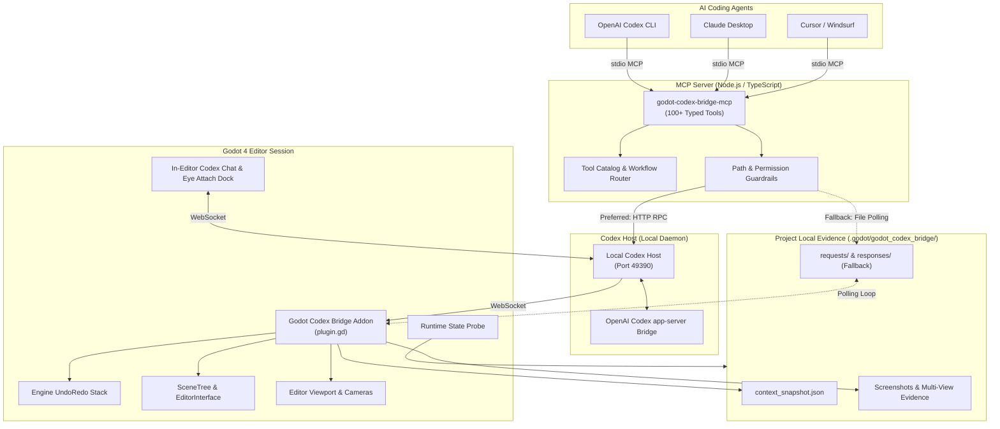
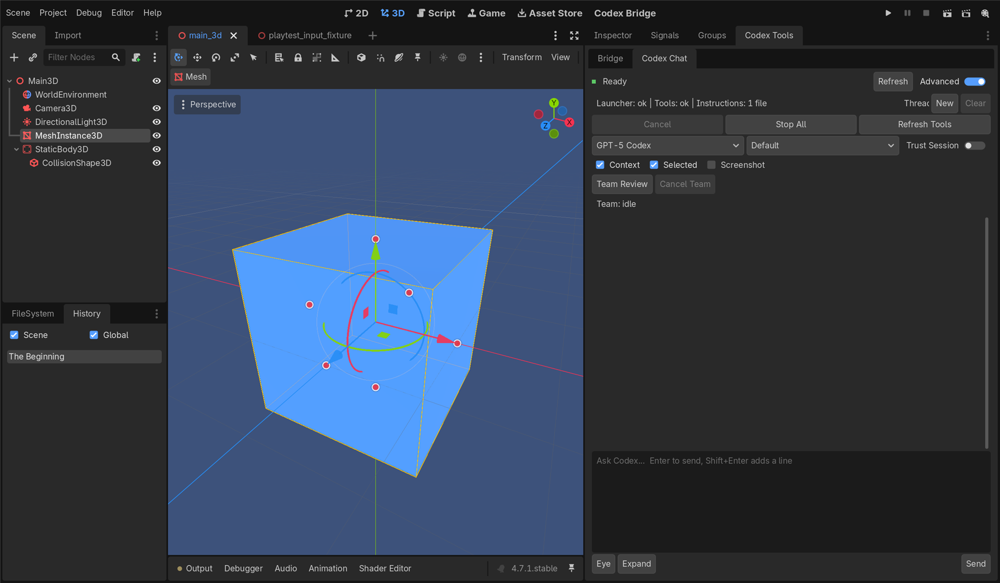
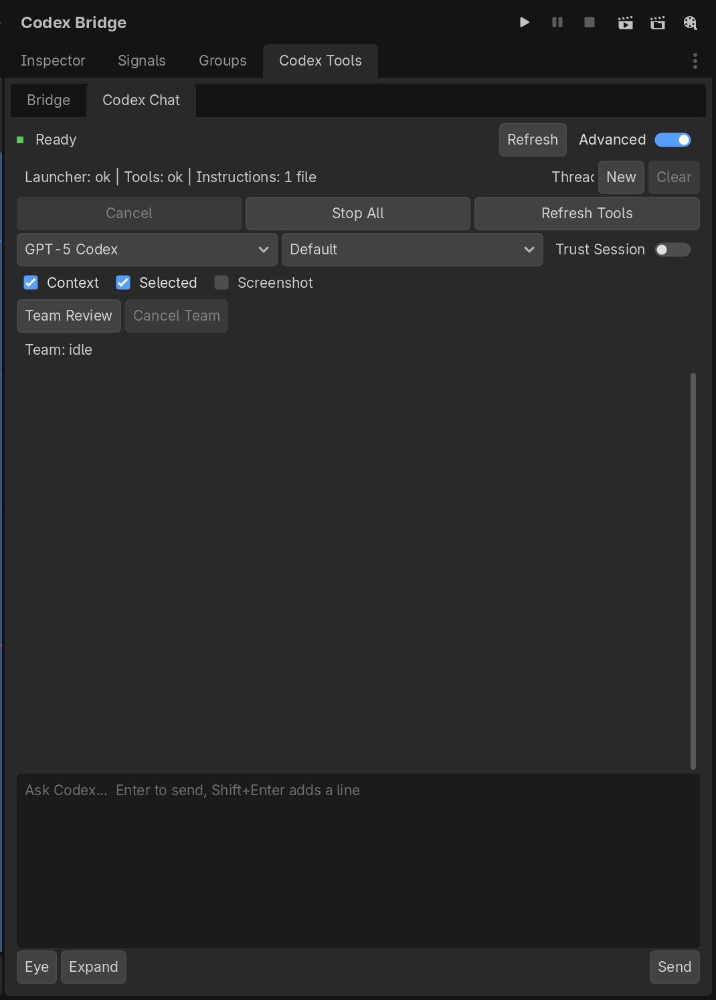
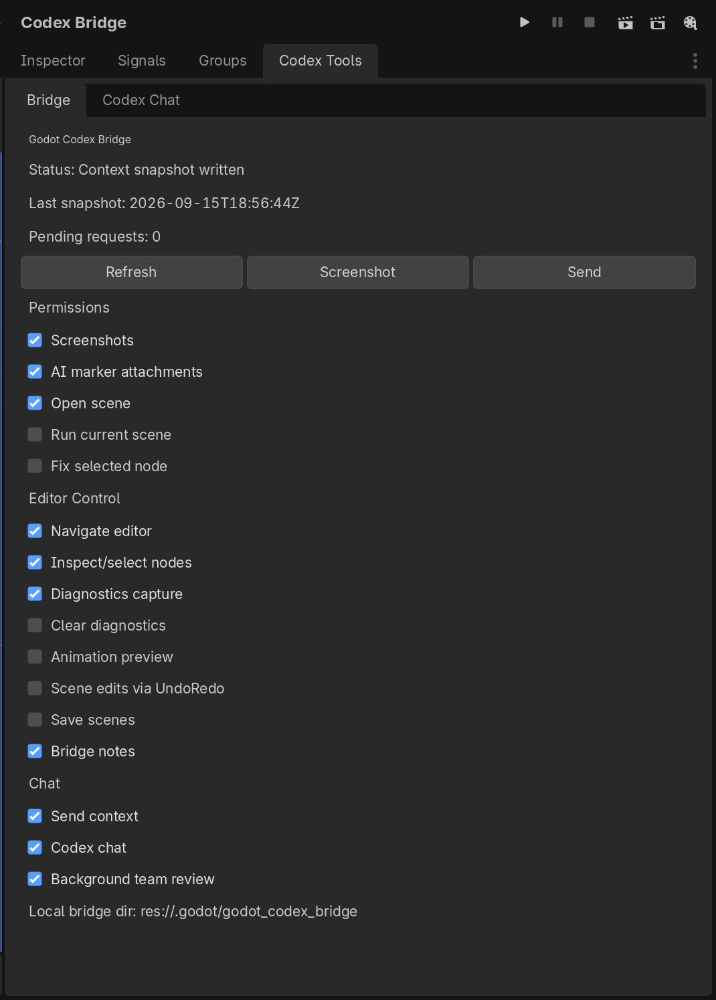
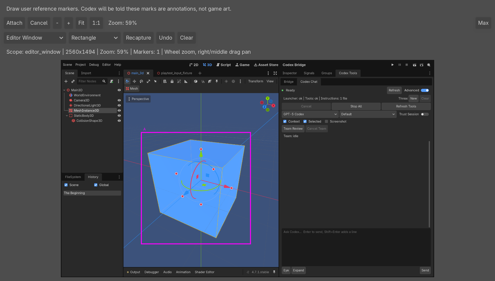
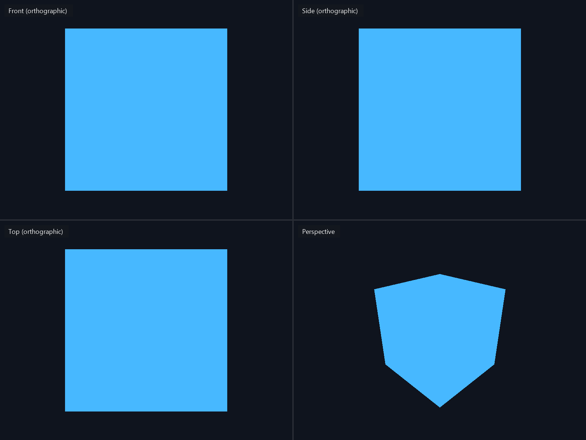

# Godot Codex Bridge

> **Godot Codex Bridge gives AI coding agents eyes, hands, and runtime feedback inside the Godot Editor.**

[](LICENSE)
[](https://godotengine.org)
[](https://nodejs.org)
[](https://modelcontextprotocol.io)

---

## The Problem

Autonomous and pair-programming AI coding agents (OpenAI Codex, Claude, Cursor, Antigravity) are traditionally blind and handless when working on game engine projects:

1. **No live engine context:** Agents only see raw `.tscn` and `.gd` text files on disk. They cannot see the active scene tree, inspect node properties, or understand 3D spatial relationships, lighting, camera frustums, or physics collision layers.
2. **No visual feedback:** Agents cannot see viewport renderings to verify whether an asset is floating in mid-air, a shader is malfunctioning, or an object is clipping through geometry.
3. **Unchecked file mutation:** Modifying `.tscn` serialization files directly often corrupts Godot internal node hierarchies, resource UIDs, or scene states without any undo history.

## What Godot Codex Bridge Enables

Godot Codex Bridge connects AI coding agents directly to the active Godot 4 Editor session through a dual-channel architecture:

- A **Model Context Protocol (MCP)** server providing **100+ typed `godot.*` tools** for scene introspection, diagnostics, live node manipulation, diff previews, and viewport screenshot capture.
- A **Godot Editor Addon** running natively inside Godot to execute commands on the engine main thread via Godot's native `UndoRedo` system, export live context snapshots, capture viewport textures, and render an in-editor **Codex Chat** dock with interactive visual annotations (**"Eye Attach"**).
- A local **Codex Host** relay daemon bridging in-editor chat with the OpenAI Codex `app-server` and providing high-speed WebSocket RPC for MCP tool execution.

---

## Key Features

- **Live Scene Introspection:** Inspect active scene metadata, node hierarchies, selected nodes, inspector properties, resource imports, autoloads, input maps, and performance monitors.
- **Visual Evidence & Multi-View Capture:** Capture single viewport screenshots (`godot.capture_viewport_screenshot`) or offscreen Front, Side, Top, and Perspective renders of a Node3D target (`godot.capture_multi_view_screenshots`).
- **UndoRedo-Backed Live Edits:** Create, transform, reparent, rename, duplicate, and delete nodes through Godot's native `UndoRedo` stack, so every change can be undone in the editor with `Ctrl+Z`.
- **Safe Diff Preview Workflow:** Review unified text diffs (`godot.preview_scene_diff`) before applying changes with approval-gated tokens (`godot.apply_approved_diff`).
- **In-Editor Codex Chat & "Eye Attach":** Collaborate with Codex directly inside a dedicated Godot dock panel. The "Eye Attach" feature lets you draw reference annotation boxes on the viewport to ground agent prompts in exact visual regions.
- **Bounded Scene Runs:** Launch the current or test scene with bounded output, exit status, and timeout evidence, gated by the dock's permission toggles.
- **Explicit Save Boundary:** The agent cannot overwrite scene files on disk during experimentation without an explicit call to `godot.save_scene`.

---

## Architecture Overview



---

## Closed-Loop Agent Workflow

Godot Codex Bridge enables agents to follow an empirical verification cycle:

```text
  1. INSPECT   ──► Read the active scene tree, selection, and diagnostics
  2. MODIFY    ──► Move or create nodes live via Godot UndoRedo
  3. RUN       ──► Launch the current or test scene with bounded output
  4. OBSERVE   ──► Capture multi-view screenshot evidence and runtime logs
  5. VERIFY    ──► Evaluate visual alignment, performance monitors, and errors
  6. SAVE      ──► Explicitly persist scene files once verified
```

---

## Visual Interface & Media

Godot Codex Bridge integrates directly into the Godot Editor interface with native controls and real-time visual grounding. All screenshots below were captured from a real Godot 4.7 editor session running the included `minimal_3d_project` fixture.

### Codex Tools Dock

The addon docks next to the Inspector, with Bridge and Codex Chat tabs alongside the live 3D scene.



### In-Editor Codex Chat

Connection status, thread controls, model and reasoning pickers, attachment toggles, and the multiline composer.



### Granular Permissions

The Bridge tab exposes explicit permission toggles. Scene edits, saves, and scene execution are off by default.



### "Eye Attach" Annotation

Capture the editor, draw reference markers, and attach them to the next prompt so the agent can see exactly which region you mean.



### Multi-View Verification

`godot.capture_multi_view_screenshots` renders Front, Side, Top, and Perspective views of a target offscreen and saves local PNGs plus a JSON manifest. These four frames came from the fixture's `MeshInstance3D`, arranged in a 2×2 grid with view labels added.



---

## Safety Model

- **Local-Only by Default:** All screenshots, snapshots, logs, and annotation artifacts reside in `.godot/godot_codex_bridge/` inside the local project. Nothing is uploaded externally.
- **Read-First Philosophy:** Tools are read-only by default; each tool's safety level is listed by `godot.get_tool_catalog`.
- **UndoRedo Protection:** All live scene and node manipulations register official Godot undo actions.
- **File System Guardrails:** File operations enforce project-root boundary checks (`isInsidePath`) and reject path traversal (`..`), absolute paths, or access to sensitive binary directories.
- **Diff Preview Before Save:** Text script and scene patches require unified diff preview review before apply.

---

## Requirements

- **Godot Engine:** Godot 4.x. Developed and validated against Godot 4.7.1; earlier 4.x releases are not verified.
- **Node.js:** Version `20.11` or higher.
- **Operating System:** Windows, Linux, or macOS.

---

## Quickstart

### 1. Clone & Build the Repository

```bash
git clone https://github.com/ItsHege/godot-codex-bridge.git
cd godot-codex-bridge

# Install root & workspace dependencies (MCP Server and Codex Host)
npm install

# Compile TypeScript packages
npm run build

# Run test suites (127 MCP tests, 46 Host tests)
npm test
```

*(You can also build or test individual packages directly from their directories: `godot-codex-bridge/mcp_server` and `godot-codex-bridge/codex_host`.)*

### 2. Configure Your Godot Executable

Set `GODOT_BIN` to point to your Godot 4 executable:

```bash
# Windows (PowerShell)
$env:GODOT_BIN = "C:\Path\To\Godot_console.exe"

# Linux / macOS
export GODOT_BIN="/usr/local/bin/godot"
```

*(If unset, the bridge automatically searches your system `PATH` for `godot` or `godot4`.)*

### 3. Install the Addon into Your Godot Project

Copy the addon folder into your Godot project:

```text
your-godot-project/
└── addons/
    └── godot_codex_bridge/
```

*(You can use `powershell -File scripts/install_addon.ps1 -ProjectRoot "path/to/project" -Apply` on Windows, or simply copy the directory.)*

Open your project in Godot, navigate to **Project Settings → Plugins**, and check **Enable** for **Godot Codex Bridge**.

---

## Agent Configuration

### A. OpenAI Codex CLI Setup (Primary)

Add the MCP server to Codex via the CLI or configuration file:

```bash
# Option 1: Via Codex CLI command (recommended)
codex mcp add godot -- node "C:/path/to/godot-codex-bridge/godot-codex-bridge/mcp_server/dist/src/index.js" --project-root "C:/path/to/your-godot-project"
```

Or in your project root or workspace `.codex/config.toml`:

```toml
# Option 2: In .codex/config.toml
[mcp_servers.godot]
command = "node"
args = [
  "C:/path/to/godot-codex-bridge/godot-codex-bridge/mcp_server/dist/src/index.js",
  "--project-root", "C:/path/to/your-godot-project"
]
```

### B. Claude Desktop Setup

Add to your `claude_desktop_config.json`:

```json
{
  "mcpServers": {
    "godot": {
      "command": "node",
      "args": [
        "C:/path/to/godot-codex-bridge/godot-codex-bridge/mcp_server/dist/src/index.js",
        "--project-root",
        "C:/path/to/your-godot-project"
      ],
      "env": {
        "GODOT_BIN": "C:/Path/To/Godot_console.exe"
      }
    }
  }
}
```

### C. Cursor Setup

Add to `.cursor/mcp.json` in your workspace:

```json
{
  "mcpServers": {
    "godot": {
      "command": "node",
      "args": [
        "${workspaceFolder}/godot-codex-bridge/mcp_server/dist/src/index.js",
        "--project-root",
        "${workspaceFolder}/your-godot-project"
      ]
    }
  }
}
```

---

## Try the Minimal 3D Example

Open the included test fixture in Godot:

```bash
# Path to fixture
godot-codex-bridge/examples/minimal_3d_project/project.godot
```

Once opened with the plugin enabled, ask your agent:

> *"Check the bridge status, inspect the current 3D scene, and capture multi-view evidence of the mesh."*

The agent will typically call:
1. `godot.bridge_status` — verifies addon heartbeat and live snapshot freshness.
2. `godot.get_current_scene` — inspects the root node and active camera.
3. `godot.capture_viewport_screenshot` — saves a local PNG of the editor viewport.
4. `godot.capture_multi_view_screenshots` — saves Front, Side, Top, and Perspective renders of the target.

---

## Repository Structure

To navigate the repository effectively:

```text
godot-codex-bridge/
├── .github/                       # CI workflow and community issue/PR templates
├── docs/images/                   # Media assets and screenshots
├── godot-codex-bridge/            # Product implementation root
│   ├── addons/godot_codex_bridge/ # Godot 4 Editor addon (GDScript)
│   ├── mcp_server/                # Model Context Protocol server (TypeScript)
│   ├── codex_host/                # Local daemon for in-editor chat & RPC (TypeScript)
│   ├── examples/                  # Minimal 3D test project & fixtures
│   ├── contracts/                 # JSON schemas and samples for bridge payloads
│   ├── tests/                     # GDScript addon tests and snapshot validators
│   ├── docs/                      # Architecture, install, quickstart, safety, and MCP tool docs
│   └── scripts/                   # Install, packaging, and validation scripts
├── package.json                   # Root npm workspace configuration
├── CONTRIBUTING.md                # Development setup, testing, and contribution rules
├── SECURITY.md                    # Vulnerability reporting and privilege boundaries
├── CHANGELOG.md                   # Release history and version tracking
└── AGENTS.md                      # Guidance for AI coding agents contributing to this repo
```

> **Note:** The repository root provides workspace-wide build, test, and CI automation; product code lives under `godot-codex-bridge/`. The addon installer writes a machine-specific `addons/godot_codex_bridge/host_config.json` into each target project. It is ignored by git; see [`host_config.example.json`](godot-codex-bridge/docs/host_config.example.json) for its shape.

---

## Documentation

- [Quickstart Guide](godot-codex-bridge/docs/QUICKSTART.md) — Step-by-step walkthrough from clean install to first agent command.
- [Install & Development Guide](godot-codex-bridge/docs/INSTALL_DEV.md) — Addon install helper, Codex Host, and visible-editor validation.
- [MCP Tool Catalog](godot-codex-bridge/docs/MCP_TOOLS.md) — Reference for the `godot.*` tools.
- [Architecture Details](godot-codex-bridge/docs/ARCHITECTURE.md) — Deep dive into snapshot serialization and RPC routing.
- [Safety Specifications](godot-codex-bridge/docs/SAFETY.md) — Threat models, approval tokens, and path confinement rules.
- [Contributing Guide](CONTRIBUTING.md) — Development setup, test commands, and PR standards.
- [Security Policy](SECURITY.md) — Vulnerability reporting and privilege boundaries.
- [Changelog](CHANGELOG.md) — Version history and release notes.

---

## Project Status & Maturity

- **Maturity:** Developer Preview / MVP.
- **Test Coverage:** 237 automated tests:
  - 127 MCP server tests (`npm run test:mcp`)
  - 46 Codex Host tests (`npm run test:host`)
  - 64 GDScript addon test scripts (`npm run validate:addon-core`, requires Godot)
- **Engine Support:** Developed and validated against Godot 4.7.1.

---

## Known Limitations

- **Editor Must Be Open for Live Tools:** Addon-backed tools (screenshots, live node selection, transform edits) require an active Godot Editor session. When Godot is closed, the bridge provides bounded offline project reading (`godot.get_scene_file_tree`, `godot.project_get_map`, `godot.read_project_file`).
- **Modal Dialog Blocking:** When a native blocking file dialog or modal confirmation is active in Godot, the main engine thread freezes, pausing heartbeat updates until dismissed.
- **Single Active Editor Session:** The bridge currently pairs one MCP server process with one target Godot project root.
- **Addon Actions Not Yet Wired:** The MCP server registers tools for these editor actions, but the v0.1.0 addon does not handle them yet, so a live editor returns `unsupported_editor_action`: `get_inspector_context`, `viewport_navigate`, `get_spatial_bounds`, `spatial_query`, `placement_check`, `snap_to_ground`, `snap_to_grid`, `undo_last_bridge_action`, `emergency_stop`, `playtest_input`, and `run_playtest_scenario`.
- **Multi-View Renders Are Proxies:** Multi-view capture renders unshaded proxies of meshes and collision shapes in an isolated world, not the fully lit editor scene. If the GPU frame comes back blank, the manifest reports `render_source: software_geometry_fallback`.

---

## License

This project is licensed under the [MIT License](LICENSE).

*Godot Engine is an open-source project registered by the Godot Foundation. OpenAI and Codex are trademarks of OpenAI. Godot Codex Bridge is an independent community open-source project and is not officially affiliated with or endorsed by OpenAI or the Godot Foundation.*
