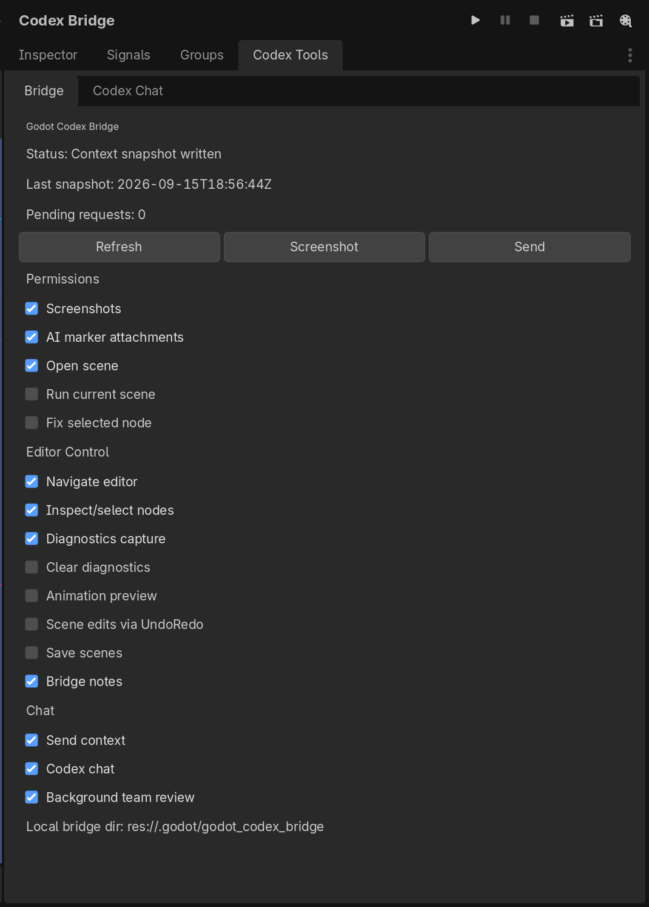
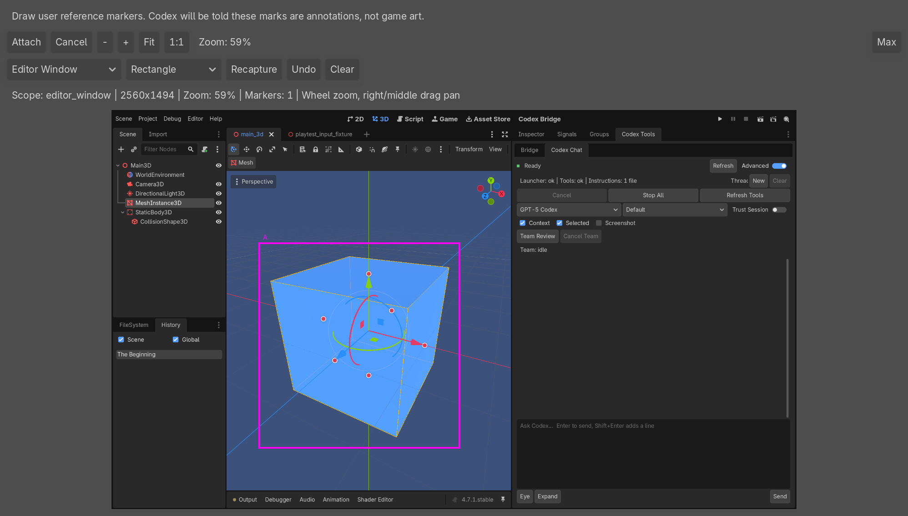
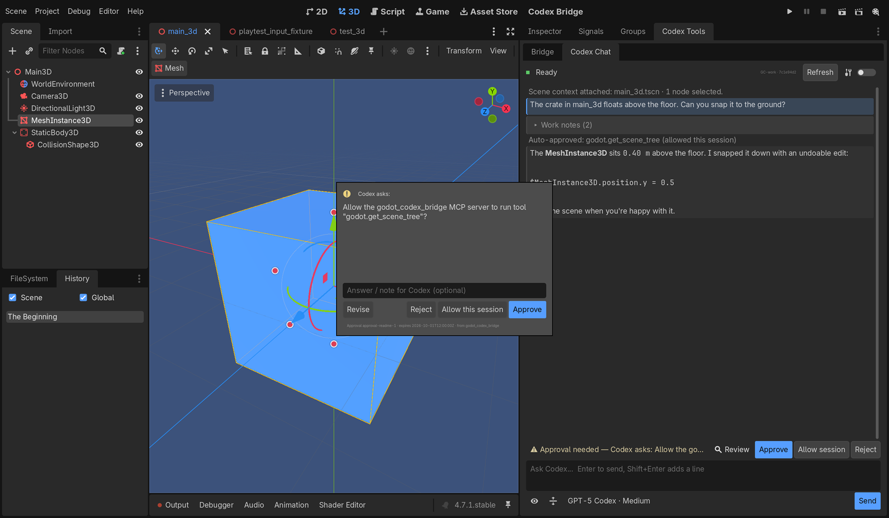
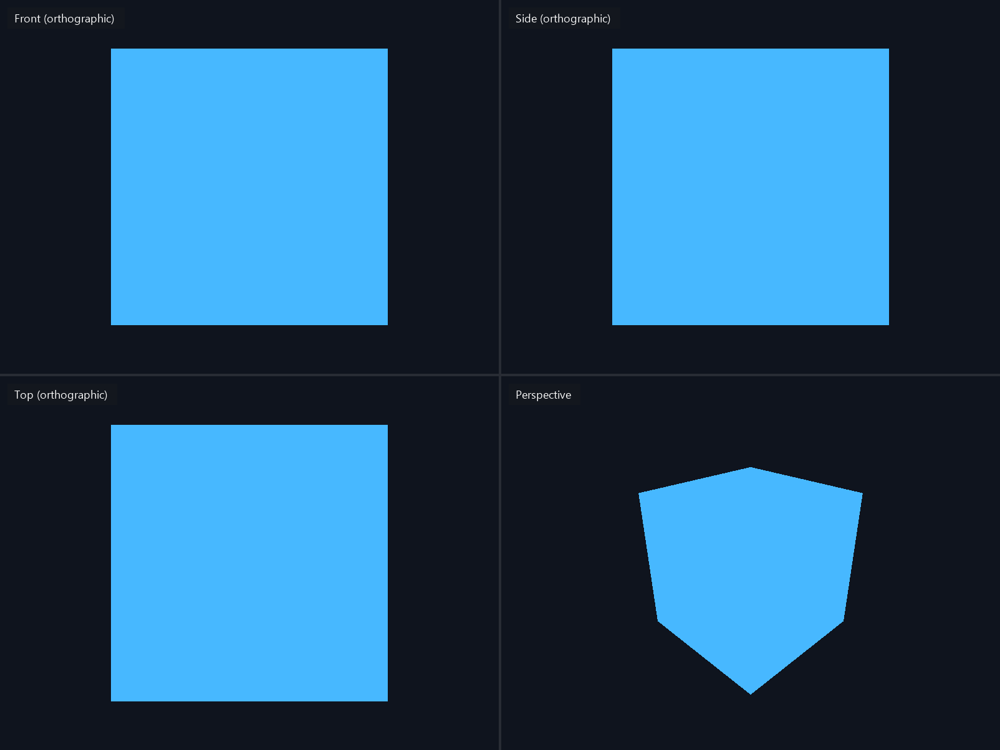
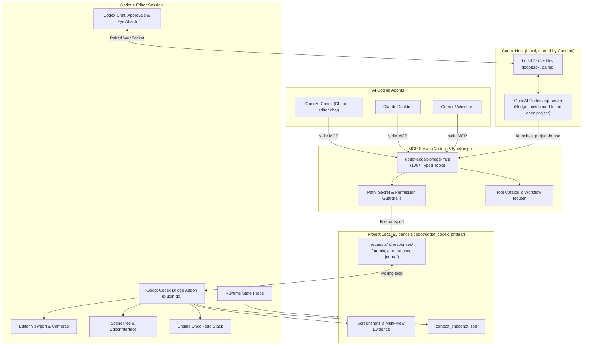

# Godot Codex Bridge

**Give AI coding agents eyes, hands and runtime feedback inside the Godot Editor.**

[](https://github.com/ItsHege/godot-codex-bridge/actions/workflows/ci.yml)
[](CHANGELOG.md)
[](LICENSE)
[](https://godotengine.org)
[](https://nodejs.org)
[](https://modelcontextprotocol.io)


Godot Codex Bridge is a Godot 4 editor addon, a local MCP server and a local
Codex Host. Together they let OpenAI Codex (in the editor or in the CLI) and
other MCP clients inspect your live scene, make undoable edits and capture
visual evidence, while you keep control of every change.

## Highlights

- **In-editor Codex chat.** Chat with Codex in a compact dock that follows the editor theme and remembers your model and reasoning choice.
- **One-click Connect (Windows).** Trust the local Host once from a terminal; after that, **Connect** starts and pairs it for you.
- **Readable approvals.** Commands, file changes and tool calls open in a review popup. Read-only Bridge tools can be allowed for the session; project changes, screenshots and runtime input always ask.
- **Eye Attach.** Capture the editor, draw lettered markers and attach them to your next prompt.
- **100+ typed `godot.*` MCP tools.** Scene introspection, diagnostics, UndoRedo-backed node edits, diff previews and screenshots, for Codex, Claude, Cursor and other MCP clients.
- **In-editor updates (Windows).** The Bridge tab checks for a newer reviewed build, installs it with a backup after Godot closes and reopens your project.
- **Local and permission-gated.** Loopback-only transport, project-bound tools, secret-file and hard-link blocking, and scene edits, saves and runs off by default.

## Contents

- [Why](#why)
- [Requirements](#requirements)
- [Quickstart](#quickstart)
- [Connect Other Agents](#connect-other-agents)
- [Keeping Projects Up to Date](#keeping-projects-up-to-date)
- [Try the Example Project](#try-the-example-project)
- [Visual Tour](#visual-tour)
- [How It Works](#how-it-works)
- [Safety Model](#safety-model)
- [Known Limitations](#known-limitations)
- [Project Status](#project-status)
- [Documentation](#documentation)
- [Repository Layout](#repository-layout)
- [License](#license)

---

## Why

AI coding agents working on Godot projects usually see only `.tscn` and `.gd`
text on disk:

- **No live context.** They cannot see the open scene tree, inspector values, cameras, lights or collision layers.
- **No visual feedback.** They cannot tell whether a mesh floats, clips or renders wrong.
- **Risky edits.** Hand-editing `.tscn` files can break node hierarchies and resource UIDs, with no undo history.

The Bridge gives agents bounded, live editor context and routes edits through
Godot's own `UndoRedo`, behind permissions you control.

---

## Requirements

- **Godot:** 4.x. Developed and validated against Godot 4.7.1; earlier 4.x releases are not verified.
- **Node.js:** 22.14 or newer; Node 24 LTS recommended. CI covers Node 22 and 24.
- **Operating system:** Windows is the primary, validated platform. The Node test suites also run on Linux in CI; macOS is untested.
- **In-editor chat:** Windows with PowerShell 7 (`pwsh`), and the OpenAI Codex CLI installed with npm (`npm install -g @openai/codex`) and signed in. The Host's app-server schemas are locked to Codex CLI 0.156.1.
- **MCP-only use:** any MCP client that can launch a local stdio server.

---

## Quickstart

### 1. Clone and build

```bash
git clone https://github.com/ItsHege/godot-codex-bridge.git
cd godot-codex-bridge
npm install
npm run build   # MCP server and Codex Host
npm test        # optional: MCP server and Codex Host test suites
```

Optionally point `GODOT_BIN` at your Godot 4 executable. If it is unset, the
Bridge looks for `godot` or `godot4` on `PATH`.

```powershell
$env:GODOT_BIN = "C:\Path\To\Godot_console.exe"   # Windows (PowerShell)
```

```bash
export GODOT_BIN="/usr/local/bin/godot"           # Linux / macOS
```

### 2. Install the addon into your game project

Your game project must live outside this checkout. The installer is a dry run
by default and prints the exact files it would add or change:

```powershell
powershell -NoProfile -ExecutionPolicy Bypass -File godot-codex-bridge/scripts/install_addon.ps1 -ProjectRoot "path/to/your-game"
powershell -NoProfile -ExecutionPolicy Bypass -File godot-codex-bridge/scripts/install_addon.ps1 -ProjectRoot "path/to/your-game" -Apply
```

Use `-Apply -Replace` to replace an existing addon copy; the previous copy is
backed up under `.godot/godot_codex_bridge/install_backups`. On other
platforms, copy `godot-codex-bridge/addons/godot_codex_bridge` into your
project's `addons/` folder.

Open the project in Godot and enable **Godot Codex Bridge** under
**Project → Project Settings → Plugins**. The **Codex Tools** dock appears next
to the Inspector, with **Bridge** and **Codex Chat** tabs.

### 3. Chat with Codex in the editor (Windows)

Trust the local Codex Host once from a PowerShell 7 terminal:

```powershell
pwsh godot-codex-bridge/scripts/start_codex_host.ps1 -Trust
```

This records the Host installation and its Node and Codex executables in
`%LOCALAPPDATA%\GodotCodexBridge\trusted_host.json`, outside every game
project. Then press **Connect** in the **Codex Chat** tab. The addon starts the
Host in the background, pairs with it automatically and binds the Bridge tools
to the open project. Closing the editor stops that Host.

If you rebuild or update the Host, Connect shows the changed fingerprint and
asks you to trust the new version before starting it.

### 4. Or use the Bridge from another agent

Skip step 3 and register the MCP server with your agent; see
[Connect Other Agents](#connect-other-agents).

---

## Connect Other Agents

The MCP server is a local stdio process. Point it at the built entry point and
at exactly one Godot project root.

### Codex plugin (recommended for the Codex CLI)

This repository includes a local Codex plugin that previews and installs the
addon and a project-scoped MCP configuration for one game:

```bash
codex plugin marketplace add .
codex plugin add godot-codex-bridge@personal
```

In a new Codex chat in your Godot project, ask Codex to set up Godot Codex
Bridge. It shows both previews before applying anything. See
[`plugins/godot-codex-bridge/README.md`](plugins/godot-codex-bridge/README.md)
for details.

### Codex CLI (manual)

```bash
codex mcp add godot -- node "/path/to/godot-codex-bridge/godot-codex-bridge/mcp_server/dist/src/index.js" --project-root "/path/to/your-game"
```

Or in `.codex/config.toml`:

```toml
[mcp_servers.godot]
command = "node"
args = [
  "/path/to/godot-codex-bridge/godot-codex-bridge/mcp_server/dist/src/index.js",
  "--project-root", "/path/to/your-game"
]
```

### Claude Desktop

Add to `claude_desktop_config.json`:

```json
{
  "mcpServers": {
    "godot": {
      "command": "node",
      "args": [
        "/path/to/godot-codex-bridge/godot-codex-bridge/mcp_server/dist/src/index.js",
        "--project-root",
        "/path/to/your-game"
      ],
      "env": {
        "GODOT_BIN": "/path/to/Godot_console.exe"
      }
    }
  }
}
```

### Cursor

Add to `.cursor/mcp.json` in your workspace:

```json
{
  "mcpServers": {
    "godot": {
      "command": "node",
      "args": [
        "/path/to/godot-codex-bridge/godot-codex-bridge/mcp_server/dist/src/index.js",
        "--project-root",
        "${workspaceFolder}"
      ]
    }
  }
}
```

Start with `godot.bridge_status` to confirm the editor is connected, and
`godot.get_tool_catalog` to pick the right tool for a task.

---

## Keeping Projects Up to Date

In-editor updates install the addon from the Host's own checkout, never from
the game project. To make a project updatable, install it once through the
update script (with Godot closed) instead of the plain installer:

```powershell
pwsh godot-codex-bridge/scripts/gc_work.ps1 -Action Publish
pwsh godot-codex-bridge/scripts/gc_work.ps1 -Action Update -ProjectRoot "path/to/your-game"
```

`Publish` marks the checkout's committed addon as the reviewed build.
`Update` installs it with a backup and registers the project. After you pull
and rebuild a newer version, run `Publish` again; the Bridge tab's **Check**
button then offers **Update**, which closes Godot through its normal close
request (so it still asks about unsaved changes), installs the build and
reopens the project. The flow is described in
[`ADDON_UPDATE_V1.md`](godot-codex-bridge/contracts/ADDON_UPDATE_V1.md).

---

## Try the Example Project

A small 3D fixture ships with the repository:

```text
godot-codex-bridge/examples/minimal_3d_project/project.godot
```

It includes the addon, so an MCP client pointed at it works right away. For
in-editor chat, copy the project outside the checkout first, because the
trusted Host refuses projects inside its own installation.

With the plugin enabled, ask your agent:

> *"Check the bridge status, inspect the current 3D scene, and capture multi-view evidence of the mesh."*

A typical run calls:

1. `godot.bridge_status`: addon heartbeat and snapshot freshness.
2. `godot.get_current_scene`: root node and active camera.
3. `godot.capture_viewport_screenshot`: a local PNG of the editor viewport.
4. `godot.capture_multi_view_screenshots`: Front, Side, Top and Perspective renders of the target.

---

## Visual Tour

All screenshots were captured from a Godot 4.7 editor running the included
`minimal_3d_project` fixture; the chat shows a staged sample conversation.

### Codex Chat

Connection status, thread controls, model and reasoning pickers, the tools
allowed for this session, and the multiline composer.


### Permissions

The Bridge tab shows snapshot and update status, context actions and a
permission profile. Individual permissions fold under "Advanced permissions";
scene edits, saves and scene runs are off by default.



### Eye Attach

Capture the editor, draw lettered markers and attach them to the next prompt so
the agent sees exactly which region you mean. Markers are listed on the side
and can be removed individually.



### Approval Review

When Codex wants to run a command, change files or use a Bridge tool, a review
popup shows exactly what it asks for.



### Multi-View Verification

`godot.capture_multi_view_screenshots` renders Front, Side, Top and Perspective
views of a target offscreen and saves local PNGs plus a JSON manifest. These
four frames came from the fixture's `MeshInstance3D`, arranged in a 2×2 grid
with view labels added.



---

## How It Works

- **Godot addon** (GDScript): runs inside the editor, executes requests on the main thread through `UndoRedo`, writes context snapshots, captures viewports and hosts the Codex Chat dock.
- **MCP server** (TypeScript): exposes the `godot.*` tools over stdio and reaches the addon through project-local request and response files. Each request has a UUID and runs at most once; retries replay the stored result instead of repeating the action.
- **Codex Host** (TypeScript): a loopback-only process started by Connect. It pairs with the addon over a local WebSocket, runs the Codex `app-server` for chat and approvals, and binds Codex's Bridge tools to the open project.


```mermaid
flowchart TD
    subgraph Agents ["AI Coding Agents"]
        Codex["OpenAI Codex (CLI or in-editor chat)"]
        Claude["Claude Desktop"]
        Cursor["Cursor / Windsurf"]
    end

    subgraph MCPLayer ["MCP Server (Node.js / TypeScript)"]
        MCPServer["godot-codex-bridge-mcp<br/>(100+ Typed Tools)"]
        ToolCatalog["Tool Catalog & Workflow Router"]
        PathGuard["Path, Secret & Permission Guardrails"]
    end

    subgraph HostLayer ["Codex Host (Local, started by Connect)"]
        CodexHost["Local Codex Host<br/>(loopback, paired)"]
        AppServer["OpenAI Codex app-server<br/>(Bridge tools bound to the open project)"]
    end

    subgraph GodotEditor ["Godot 4 Editor Session"]
        Addon["Godot Codex Bridge Addon<br/>(plugin.gd)"]
        ChatDock["Codex Chat, Approvals & Eye Attach"]
        UndoRedo["Engine UndoRedo Stack"]
        SceneTree["SceneTree & EditorInterface"]
        Viewport["Editor Viewport & Cameras"]
        RuntimeProbe["Runtime State Probe"]
    end

    subgraph LocalStorage ["Project Local Evidence (.godot/godot_codex_bridge/)"]
        Snapshot["context_snapshot.json"]
        Artifacts["Screenshots & Multi-View Evidence"]
        Transport["requests/ & responses/<br/>(atomic, at-most-once journal)"]
    end

    Codex -->|stdio MCP| MCPServer
    Claude -->|stdio MCP| MCPServer
    Cursor -->|stdio MCP| MCPServer

    MCPServer --> ToolCatalog
    MCPServer --> PathGuard
    PathGuard -->|File transport| Transport
    Transport <-->|Polling loop| Addon

    ChatDock <-->|Paired WebSocket| CodexHost
    CodexHost <--> AppServer
    AppServer -->|launches, project-bound| MCPServer

    Addon --> Snapshot
    Addon --> Artifacts
    Addon --> UndoRedo
    Addon --> SceneTree
    Addon --> Viewport
    RuntimeProbe --> LocalStorage
```

A typical agent loop:

```text
1. INSPECT  ─► Read the scene tree, selection and diagnostics
2. MODIFY   ─► Create or move nodes live through Godot UndoRedo
3. RUN      ─► Run the current scene (when its permission is enabled)
4. OBSERVE  ─► Capture viewport or multi-view screenshots and runtime output
5. VERIFY   ─► Check placement, performance monitors and errors
6. SAVE     ─► You review and save in the Godot editor
```

---

## Safety Model

- **Local only.** Snapshots, screenshots, logs and annotations stay in `.godot/godot_codex_bridge/` inside your project. The Bridge adds no telemetry and uploads nothing; Codex itself talks to your configured model provider.
- **Loopback and pairing.** The Codex Host binds to loopback only and pairs with the addon using a per-launch secret and mutual proofs. Unpaired connections cannot call privileged methods.
- **Per-user trust.** Connect only launches what `%LOCALAPPDATA%\GodotCodexBridge\trusted_host.json` names and refuses a changed installation until you trust it again. Project files cannot choose what runs.
- **Read-first tools.** Every tool's safety level is listed by `godot.get_tool_catalog`. Scene edits, saves and scene runs are off by default in the addon's permissions.
- **Undoable edits.** Live node changes register native Godot `UndoRedo` actions, so `Ctrl+Z` works.
- **Path guardrails.** File access stays inside the project root and rejects traversal, absolute paths, symbolic links, junctions and hard-linked files. Project reading tools never return common secret files such as `.env*`, keys, keystores and credentials.
- **Explicit saves.** Bridge scene-save tools and direct diff application are disabled. Review changes with `godot.preview_scene_diff` and save through Godot's own UI.

See [SAFETY.md](godot-codex-bridge/docs/SAFETY.md) for the full threat model and
[SECURITY.md](SECURITY.md) to report a vulnerability.

---

## Known Limitations

- **Live tools need the editor.** Screenshots, selection and node edits require a running Godot editor. With Godot closed, offline tools such as `godot.get_scene_file_tree`, `godot.project_get_map` and `godot.read_project_file` still read the project.
- **Modal dialogs pause the Bridge.** A blocking Godot dialog freezes the editor main thread, so heartbeats and requests wait until it closes.
- **One project per server.** Each MCP server process serves exactly one Godot project root.
- **Playtest input is disabled.** `godot.playtest_input` and `godot.run_playtest_scenario` fail closed until the addon exposes trusted runtime authorization. `godot.editor_viewport_navigate` supports the 2D viewport only.
- **Windows-only conveniences.** One-click Connect and in-editor updates use PowerShell 7 on Windows. Other platforms are not validated for in-editor chat.
- **Multi-view renders are proxies.** Multi-view capture renders unshaded proxies of meshes and collision shapes in an isolated world, not the lit editor scene. If the GPU frame comes back blank, the manifest reports `render_source: software_geometry_fallback`.

---

## Project Status

- **Maturity:** developer preview.
- **Tests:** each layer has an automated suite; run them for current results.
  - MCP server: `npm run test:mcp`
  - Codex Host: `npm run test:host`
  - GDScript addon: `npm run validate:addon-core` (requires Godot)
- **CI:** Node tests on Windows and Ubuntu with Node 22 and 24, plus a headless addon regression on a checksum-pinned Godot 4.7.1 build.

---

## Documentation

- [Quickstart Guide](godot-codex-bridge/docs/QUICKSTART.md): from a clean install to your first agent command.
- [Install & Development Guide](godot-codex-bridge/docs/INSTALL_DEV.md): addon installer, Codex Host, updates and validation.
- [MCP Tool Reference](godot-codex-bridge/docs/MCP_TOOLS.md): the `godot.*` tools.
- [Architecture](godot-codex-bridge/docs/ARCHITECTURE.md): snapshots, transport and routing.
- [Safety](godot-codex-bridge/docs/SAFETY.md): threat model, approvals and path confinement.
- [Contracts](godot-codex-bridge/contracts/README.md): payload schemas, file transport, connect and update contracts.
- [Contributing](CONTRIBUTING.md): development setup, tests and PR checklist.
- [Security Policy](SECURITY.md): vulnerability reporting and privilege boundaries.
- [Changelog](CHANGELOG.md): release history.

---

## Repository Layout

```text
godot-codex-bridge/
├── .github/                       # CI workflow and issue/PR templates
├── docs/images/                   # README and changelog screenshots
├── godot-codex-bridge/            # Product root
│   ├── addons/godot_codex_bridge/ # Godot 4 editor addon (GDScript)
│   ├── mcp_server/                # MCP server (TypeScript)
│   ├── codex_host/                # Local Codex Host for in-editor chat (TypeScript)
│   ├── contracts/                 # Payload schemas, file transport, connect and update contracts
│   ├── examples/                  # Minimal 3D fixture project
│   ├── tests/                     # GDScript addon tests and snapshot validators
│   ├── docs/                      # Install, quickstart, architecture, safety and tool docs
│   └── scripts/                   # Install, Host launcher, update, packaging and validation scripts
├── plugins/godot-codex-bridge/    # Local Codex plugin: addon and project MCP setup
├── package.json                   # Root npm workspace
├── CONTRIBUTING.md
├── SECURITY.md
├── CHANGELOG.md
└── AGENTS.md                      # Guidance for AI agents contributing to this repo
```

The installer writes a machine-specific `addons/godot_codex_bridge/host_config.json`
into each target project with loopback connection details. It is ignored by
git and never decides what the editor launches; see [`host_config.example.json`](godot-codex-bridge/docs/host_config.example.json)
for its shape.

---

## License

Licensed under the [MIT License](LICENSE).

*Godot Engine is an open-source project registered by the Godot Foundation. OpenAI and Codex are trademarks of OpenAI. Godot Codex Bridge is an independent community project and is not affiliated with or endorsed by OpenAI or the Godot Foundation.*
